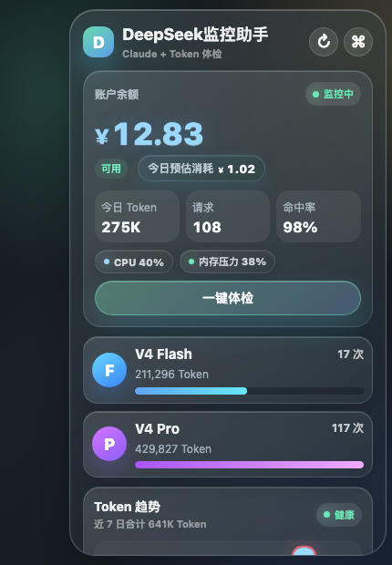
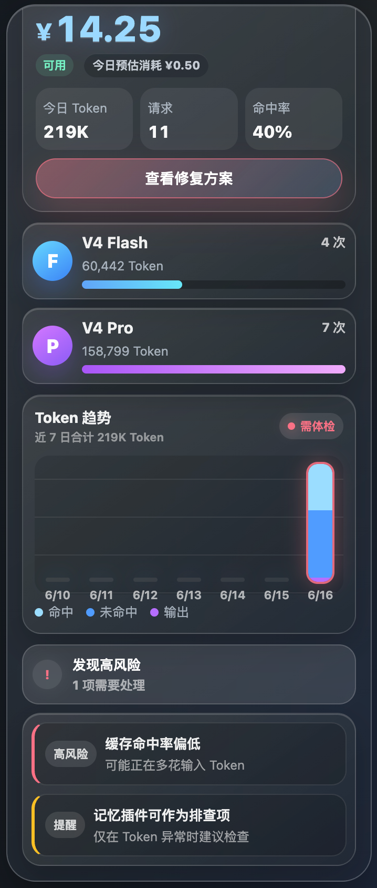
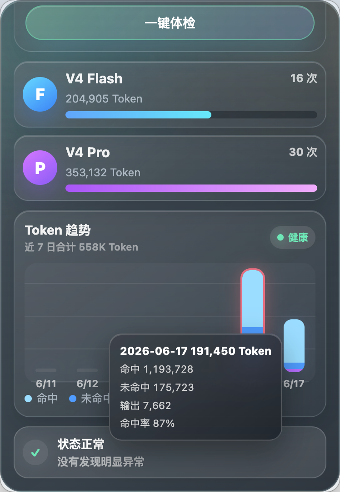

# DeepSeek监控助手 | DeepSeek Claude Code Token & Cache Monitor

> A lightweight tray monitor for Claude Code + DeepSeek token usage, cache hit rate, account balance, and safe one-click diagnostics.



## Download

Packaged desktop builds are published in [GitHub Releases](https://github.com/a148325128-max/deepseek-token-monitor/releases):

- macOS Apple Silicon: `DeepSeek-Monitor-0.1.0-mac-arm64.dmg`
- Windows x64 portable app: `DeepSeek-Monitor-0.1.0-win-x64.exe`

macOS may show a security warning because the app is not notarized yet. If that happens, open it from Finder with right click -> Open.

## Why This Exists

Claude Code + DeepSeek is powerful, but real usage has a very specific pain:

- Token usage suddenly jumps.
- Cache hit rate drops after a long session.
- A new conversation shows low cache hit rate even though it is only warming up.
- Users cannot tell whether the problem is DeepSeek, Claude Code config, CC Switch, context rebuilds, or local plugin state.

DeepSeek监控助手 is built for this workflow:

```text
Claude Code -> local proxy -> DeepSeek Anthropic-compatible API
```

It does not try to be a giant system monitor. The core feature is: **show token usage clearly, understand cache hit health correctly, and only repair what is safe to repair.**

## Product Highlights

- **Tray popover UI**: compact Apple-style translucent panel for daily monitoring.
- **DeepSeek balance**: optional local balance key, only stored on your machine.
- **Token dashboard**: today's tokens, request count, V4 Flash / V4 Pro split, and 7-day token trend.
- **Cache hit health**: cache hit/miss tracking from DeepSeek usage fields.
- **New-session warmup logic**: a fresh Claude Code conversation will not immediately trigger a false low-cache alarm.
- **Long-session risk detection**: alerts when cache misses remain high after warmup or when miss tokens suddenly spike.
- **Safe Doctor**: checks proxy routing, CC Switch / Claude Code connection, repeated API errors, token risk, and claude-mem context.
- **Controlled repair**: safe pre-checks can run automatically; destructive actions still require confirmation.
- **macOS + Windows direction**: macOS tray popover is the primary tested version; Windows can run the same Electron app and local proxy.

## 中文亮点

- **看得懂钱花在哪**：实时显示今日 Token、请求次数、今日预估消耗和 DeepSeek 余额。
- **看得懂缓存是否健康**：区分命中、未命中和输出 Token，不把新对话预热误判成故障。
- **看得懂哪个模型在消耗**：单独显示 V4 Flash / V4 Pro 的请求次数和 Token 占比。
- **体检不是吓人**：只有长会话持续低命中、未命中 Token 突然放大、请求连续失败时才提醒。
- **修复不乱动配置**：能自动预检查；清理缓存、禁用插件、改配置都需要用户确认并保留备份。

## 真实场景对比

缓存命中异常时，工具会把风险高亮出来，并给出修复建议：



运行体检和修复建议后，状态恢复为健康，趋势图仍保留命中/未命中/输出明细：



## What Makes It Different

Most API dashboards show usage after the fact. This tool focuses on the Claude Code + DeepSeek workflow itself:

- It understands DeepSeek's cache hit/miss token fields.
- It separates "new conversation warmup" from real cache failure.
- It can create a monitored CC Switch provider without changing the original provider.
- It keeps prompt and response content out of local storage.
- It gives repair suggestions only when a problem is actionable.

## What Works In V0.1

- Local DeepSeek proxy for Anthropic-compatible Claude Code requests.
- Local DeepSeek proxy for OpenAI-compatible chat completion requests.
- Token usage capture from provider responses.
- Cache hit/miss capture when DeepSeek returns cache usage fields.
- macOS tray popover, plus Windows-compatible proxy/web panel and Electron tray runtime.
- Doctor diagnostics for:
  - low cache hit rate
  - cache miss spikes
  - repeated upstream errors
  - no captured traffic
  - claude-mem status and oversized logs/cache folders
- Safe repair actions for:
  - dry-run claude-mem cleanup
  - apply claude-mem cache/log cleanup with explicit confirmation
  - disable/enable claude-mem with timestamped settings backup

The main `一键体检` button follows this rule:

- If there are safe automatic actions, it shows `一键修复可处理项`.
- Destructive or configuration-changing actions still require confirmation.
- If there are no automatic actions, it shows `查看修复建议`.

The app does not store prompt or response content. It only stores usage metadata such as model, tokens, cache hit/miss, latency, status code, and error code.

Do not commit `.env`, settings files, screenshots, logs, or examples that contain real API keys.

## Quick Start

Install dependencies:

```bash
npm install
```

Run the tray app:

```bash
npm start
```

Or run only the proxy and web panel:

```bash
npm run dev:proxy
```

Open:

```text
http://127.0.0.1:17860
```

## Platform Notes

### macOS

macOS is the primary development platform for V0.1. The app runs as a menu bar tray popover and supports hover/click opening.

### Windows

Windows support is designed around the same local proxy and Electron tray runtime:

- `npm start` runs the Electron app.
- `npm run dev:proxy` runs the local web panel and proxy.
- CC Switch deep-link import works if CC Switch is installed and the `ccswitch://` protocol is registered.
- Direct Claude Code configuration works without CC Switch.
- Cloning the current CC Switch provider requires the `sqlite3` command to be available in `PATH`; if it is missing, the app falls back to import/direct setup instead of crashing.

## Claude Code + DeepSeek Setup

This project uses a BYOK model: bring your own key. The repository never includes a DeepSeek key, and the author does not provide a shared key.

DeepSeek keys are only fully visible when they are created. If an existing key is already masked in the console, you cannot recover it from the list. Create a new dedicated key for this tool, copy it once, and keep it locally. If a key is leaked, delete it in the DeepSeek console and create a replacement.

### Recommended: CC Switch Import

If CC Switch is installed, open the panel, paste a newly-created DeepSeek key, and click "保存到 CC Switch（推荐）".

The app generates a local `ccswitch://v1/import` provider link with:

```text
App:      claude
Endpoint: http://127.0.0.1:17860/anthropic
API Key:  your newly-created DeepSeek key
```

CC Switch will open an import confirmation dialog. After import, switch Claude Code to the imported provider in CC Switch, then run Doctor again.

### Create A Monitored CC Switch Copy

If CC Switch already has a working DeepSeek provider, click "开始监控".

This does not read, print, copy, or export the raw key. It creates local backups, clones the current Claude provider, and changes only the cloned provider endpoint from DeepSeek's remote URL to the local monitor URL:

```text
http://127.0.0.1:17860/anthropic
```

The original direct DeepSeek provider remains unchanged, so users can switch back when the monitor is not running. After creating the monitored copy, restart Claude Code and run Doctor.

### Fallback: Direct Claude Code Config

If CC Switch is not installed, click "直接配置 Claude Code". The app writes the same endpoint and key to your local Claude Code settings file, with a timestamped backup first.

### Manual Shell Setup

Point Claude Code at the local proxy:

```bash
export ANTHROPIC_BASE_URL="http://127.0.0.1:17860/anthropic"
export ANTHROPIC_AUTH_TOKEN="<your-new-deepseek-key>"
claude
```

Run these commands in the same shell. The variable name is `ANTHROPIC_AUTH_TOKEN` because Claude Code reads Anthropic-compatible settings, but the value is your DeepSeek key.

The proxy forwards requests to:

```text
https://api.deepseek.com/anthropic
```

DeepSeek documents this Anthropic-compatible endpoint and Claude Code usage pattern in its Anthropic API guide.

## OpenAI-Compatible DeepSeek Setup

For OpenAI-compatible clients, use:

```text
Base URL: http://127.0.0.1:17860/v1
API Key:  <your-new-deepseek-key>
```

## Doctor Rules

Doctor currently checks:

- Latest and recent cache hit rate.
- Recent cache miss token spikes.
- Upstream HTTP errors.
- Whether the proxy has seen any requests.
- Whether claude-mem is enabled.
- Whether claude-mem logs/cache folders are large.

Actions that change files require an explicit click in the UI or `confirm: true` on the repair API. Settings edits create timestamped backups.

## Local Data

Default data directory:

```text
~/.deepseek-monitor-assistant
```

For compatibility, an existing `~/.deepseek-cache-doctor` directory is reused automatically.

Main event log:

```text
usage-events.jsonl
```

Each event stores only metadata:

```json
{
  "provider": "deepseek",
  "apiFormat": "anthropic",
  "model": "claude-sonnet-...",
  "inputTokens": 123,
  "outputTokens": 45,
  "totalTokens": 168,
  "cacheHitTokens": 100,
  "cacheMissTokens": 23,
  "latencyMs": 1200,
  "statusCode": 200
}
```

## Sources

- DeepSeek Anthropic API: https://api-docs.deepseek.com/guides/anthropic_api
- DeepSeek Context Caching: https://api-docs.deepseek.com/guides/kv_cache
- Anthropic Prompt Caching: https://platform.claude.com/docs/en/build-with-claude/prompt-caching
- Anthropic Usage and Cost API: https://platform.claude.com/docs/en/manage-claude/usage-cost-api
- CC Switch Deep Link Protocol: https://github.com/farion1231/cc-switch/blob/main/docs/user-manual/en/5-faq/5.3-deeplink.md

## Roadmap

- Provider adapters for Zhipu, OpenAI, Gemini, Qwen, Volcengine, OpenRouter, and SiliconFlow.
- Model price table and cost estimation.
- Native package builds for macOS and Windows.
- Optional floating pill mode.
- Optional pet skin after the core doctor is proven.
